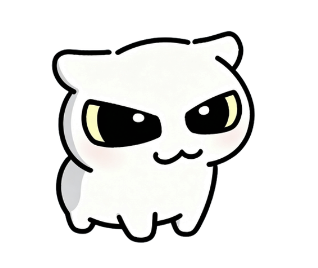
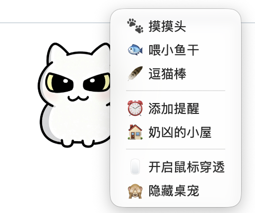

# 🐾 奶凶小猫 · naixiong-pet-app

一只住在你桌面上的傲娇小猫。**Electron 桌宠**应用：全透明无边框窗口浮在所有窗口之上，会呼吸、会眨眼、能被拖着在屏幕上走，还能摸头、喂小鱼干、逗猫棒，以及给未来的自己写定时提醒。

所有的角色设定、互动、动作帧、动效参数都集中在一个文件里 —— `pet-spec.json`。改这个文件就等于改整个桌宠，不需要碰一行 TypeScript。

---

## 📸 截图

<p align="center">
  
  &nbsp;&nbsp;&nbsp;
  
</p>

<p align="center">
  <sub>左边是桌宠本体（透明窗口，直接浮在桌面上）；右边是右键菜单 —— 三种互动、提醒、小屋、鼠标穿透都在这里</sub>
</p>

---

## ✨ 特性一览

### 桌宠本体
- **透明无边框窗口**：220px 基准尺寸，4 档缩放（0.65 / 0.8 / 1.0 / 1.2），始终置顶。
- **呼吸感**：周期性微缩放呼吸动画 + 点击时的挤压回弹（squash & stretch），参数可调。
- **9 种状态**：`idle`（循环待机）、`blink`（随机眨眼）、`tap`、`random-idle`、`edge-snap`（吸附边缘）、`reminder`、`pet-head`、`feed-fish`、`play-teaser`。
- **48 张 512×512 透明 PNG**，全部由 `tools/process-assets.mjs` 语义抠图管线处理后统一命名。
- **拖拽 + 边缘吸附**：按住拖动，松手自动贴到最近的屏幕边缘并触发 `edge-snap` 表情。
- **鼠标穿透**：一键开启，让猫变成桌面上的一层图案，点不到也打扰不到你。

### 互动与养成
| 互动 | 效果 | 好感度 |
| --- | --- | --- |
| 🐾 摸摸头 | 播放 6 帧委屈又享受的动作 | +5 |
| 🐟 喂小鱼干 | 咔嚓咔嚓进食动画 | +8 |
| 🪶 逗猫棒 | 扑羽毛动作 | +6 |

每次互动随机触发一句台词气泡（台词写在 spec 里，随便改），例如：

> 「哼……才、才不是稀罕呢」
> 「小鱼干！算你识相」
> 「本喵只是测试你的反应」

### 控制面板（「奶凶的小屋」）
右键桌宠 → 打开小屋，可以看到 **好感度 / 心情值 / 今日互动次数 / 累计陪伴分钟数**，也能在这里直接点按钮互动、切换置顶、切换鼠标穿透、调整体型。

### 定时提醒
在托盘菜单点「⏰ 添加提醒」，写下文字和时间。到点时提醒窗口从桌宠头顶弹出，同时猫会切换到 `reminder` 状态提醒你。提醒持久化在 `userData/reminders.json`，重启后依然生效。

### 托盘常驻
菜单栏托盘图标常驻：显示/隐藏桌宠、打开小屋、切换鼠标穿透、退出。

---

## 🔒 安全设计

虽然只是一只小猫，但这个项目是按 Electron 的安全基线写的：

- `contextIsolation: true`、`nodeIntegration: false`、`sandbox: true`，渲染进程拿不到 Node。
- 所有能力都经由 preload 暴露的白名单 IPC 通道，主进程用 `assertSender()` 校验**调用方窗口角色**（pet / dashboard / reminder 权限各不相同）并校验 `senderFrame`，越权调用直接抛错。
- 所有 IPC 入参都过一遍 `contracts.ts` 里的运行时断言（类型、长度、枚举值），不信任渲染层传来的任何东西。
- 拦截 `window.open` 与所有权限请求（`setPermissionRequestHandler` → 一律拒绝）。
- Electron Fuses 全面收紧：禁用 `RunAsNode`、禁用 `NODE_OPTIONS` 环境变量、禁用 inspect 参数、**强制只从 asar 加载**、开启 asar 完整性校验与 Cookie 加密。
- 渲染进程崩溃 / 控制台出现 Uncaught 错误 → 写结构化失败报告并退出，不带着坏状态继续跑。

## 🧪 工程化：自带 QA 门禁

这个项目把「肉眼看着还行」变成了数字：

```bash
npm run check          # TypeScript 类型检查 + 全套静态/资产/UI/体验校验
npm test               # 单元测试（状态机、拖拽、持久化、体验配置）
npm run test:e2e       # Playwright + Electron 端到端测试
npm run test:soak      # 长时间稳定性压测（可选 1 小时）
npm run test:dev-smoke # 开发态冒烟（隔离 userData + 自动关进程）
```

`npm run check` 会依次跑：

| 环节 | 校验内容 |
| --- | --- |
| `tsc --noEmit` | 类型零错误 |
| `validate-dev-contract` | 关键文件哈希与开发契约未被破坏 |
| `validate-spec` | `pet-spec.json` 符合 schema v5 |
| `validate-asset-links` | spec 里引用的每一帧素材都存在，且没有孤儿素材 |
| `qa-ui` | 11 项 UI 断言 |
| `qa-experience` | 9 状态 / 10 触发器 / 9 组多帧动作 |
| `qa-assets` | 48/48 素材逐张校验尺寸、透明通道与 sha256 |

启动开发态之前，主进程还会**再验一遍素材哈希**（`verifySourceAssetGate`）—— QA 报告里记录的 sha256 和磁盘上的文件对不上，应用直接拒绝启动。也就是说：素材被改过但没重新跑 QA，是跑不起来的。

---

## 🚀 快速开始

**环境要求**：Node.js 22 ~ 24（Electron Forge 7 不支持 Node 25+）、macOS 或 Windows。

```bash
git clone https://github.com/aad083097-web/naixiong-pet-app.git
cd naixiong-pet-app
npm install
npm run dev
```

`npm run dev` 会自动完成：依赖预检 → 全套 `check` → 编译主进程 → 起三个渲染进程的 dev server → 启动 Electron。看到屏幕中间冒出一只猫就成功了。

日志落在 `.build/dev.log`，运行时状态落在 `.build/dev-status.json`。

### 打包

```bash
npm run package:mac    # 产出 .app
npm run make:mac       # 产出 .dmg
npm run package:win    # 产出 Windows 目录
npm run make:win       # 产出 Squirrel 安装包
npm run portable:mac   # 产出免安装 zip
```

打包产物默认是**未签名**的，macOS 首次打开需要右键 →「打开」，或自行做公证。

---

## 🗂 目录结构

```
pet-spec.json              # ⭐ 唯一数据源：角色、状态、互动、配色、动效、功能开关
forge.config.js            # Electron Forge 配置（webpack 三入口 + Fuses）
src/
  main.ts                  # 主进程：三个窗口、托盘、IPC、提醒调度、持久化
  preload.ts               # contextBridge 白名单 API
  shared/contracts.ts      # 类型 + 运行时断言（主/渲染共用）
  main/                    # 拖拽几何、日志、持久化、数据校验、键盘监听
  renderer/
    pet/                   # 桌宠窗口 + 帧状态机
    dashboard/             # 「小屋」控制面板
    reminder/              # 提醒编辑/弹出窗口
  assets/pet/              # 48 张动作帧 + core-ip.png（角色母图）
tools/                     # 开发/构建/QA 工具链（见下表）
tests/unit · tests/e2e     # 单元测试与 Playwright 端到端测试
docs/screenshots/          # README 用的截图
```

### 工具链

| 脚本 | 作用 |
| --- | --- |
| `tools/run-dev.mjs` | 开发态总控：预检 → check → 起 Forge → 等三个渲染进程全部 ready |
| `tools/process-assets.mjs` | 素材加工：抠背景、羽化边缘、统一构图与尺寸 |
| `tools/semantic-cutout.mjs` | 抠图后端（含 Vision 框架加速的 Swift 实现） |
| `tools/qa-*.mjs` | UI / 体验 / 素材三类 QA 报告生成 |
| `tools/run-build.mjs` | 打包总控，校验通过才允许 Forge 打包 |
| `tools/doctor.mjs` · `tools/preflight.mjs` | 环境体检与依赖预检 |

---

## 🎨 换一只属于你的宠物

不用改代码，改 `pet-spec.json`：

```jsonc
{
  "app":        { "name": "奶凶小猫" },          // 应用名
  "character":  { "displayName": "奶凶", "personality": ["傲娇", "嘴硬心软", "贪吃"] },
  "experience": {
    "theme": { "accent": "#FF8FA3", "cornerRadius": 20 },   // 配色
    "interactions": [ /* 互动、台词、好感度 */ ]
  },
  "states":     [ /* 每个动作的帧序列、帧时长、优先级、冷却、打断策略 */ ],
  "motion":     { "breathing": { "periodMs": 3200 } },
  "features":   { "tray": true, "edgeSnap": true, "filePocket": false /* … */ }
}
```

在 `src/assets/pet/` 里放上对应的帧图片，再跑：

```bash
npm run process:assets   # 加工素材
npm run check            # 生成新的 QA 报告（含新哈希）
npm run dev
```

状态机本身是通用的：帧序列、循环、优先级、冷却时间、打断策略（`resume` / `restart` / `discard`）全部读 spec，所以换角色不需要动 `state-machine.ts`。

---

## 📌 已知限制

- 点击桌宠时调用的是 `happy` 状态，但当前 spec 里没有定义 `happy`，因此**只有挤压回弹动画、没有专属表情**。想看到表情可以自己加一个 `happy` 状态，或把它改成已有的 `tap`。
- `random-idle`（随机小动作）目前定时器只做重排，**尚未真正触发随机动作**，预留在 `scheduleIdleEvents()` 里。
- `features.filePocket` / `typingReaction` / `autonomousMovement` 在 spec 里处于关闭状态，对应的代码路径已经写好但没有在 UI 上暴露。
- 打包产物未签名，Windows 端首次运行可能触发 SmartScreen 提示。
- 在**受限沙箱环境**（某些 CI / 容器 / 被安全的 shell）里运行 Electron 时，Chromium 自身沙箱可能初始化失败并导致渲染进程崩溃，此时需要给 Electron 追加 `--no-sandbox`。普通终端下不需要。

## 📄 许可证

代码以 [MIT](LICENSE) 协议开源，可自由使用、修改、分发，保留版权声明即可。

`src/assets/pet/` 下的角色素材随项目一同提供，供学习与二次创作使用；如果你打算把它用于商业产品，建议替换成自己的美术资源。

## 🙏 说明

角色「奶凶」是一张单图母版（`core-ip.png`）经 `tools/process-assets.mjs` 抠图、对齐、派生出的整套动作帧。整个项目围绕一个 spec 驱动 + QA 门禁的思路写成 —— 它既是桌宠，也是一份「如何把桌面小玩具做得可维护」的参考实现。
